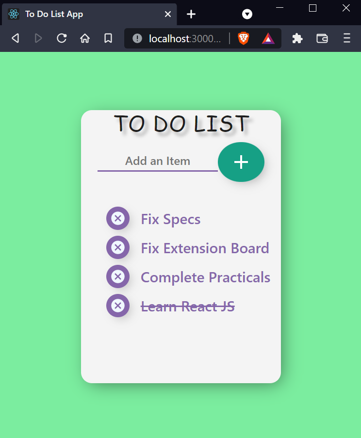

## To Do List : 
    A beginner friendly To do List App to manage daily tasks. It has great degree of responsiveness. Created using React technology.

--- 

---

# Steps to run the Server : 

- Clone this Git Repository

- Take the Project Folder out from the Cloned Project.

- In the terminal, change directory to ToDoList_Website    
        cd Code-Your-Websites/ToDoList_Website

- delete package-lock.json in the ToDoList_Website directory

- In the terminal, run this command to install all the dependencies for the project(npm, node should be installed)
    
        npm install --legacy-peer-deps

- Run the server
    
        npm start

---